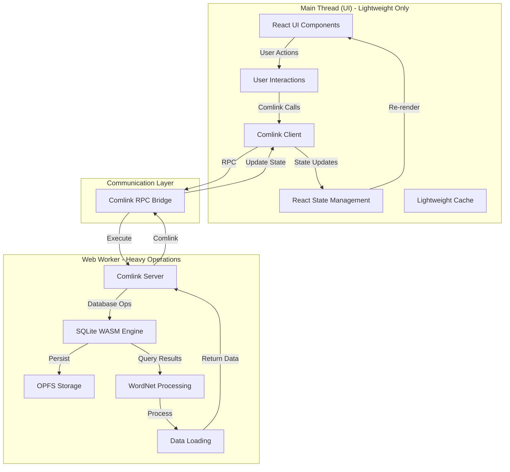
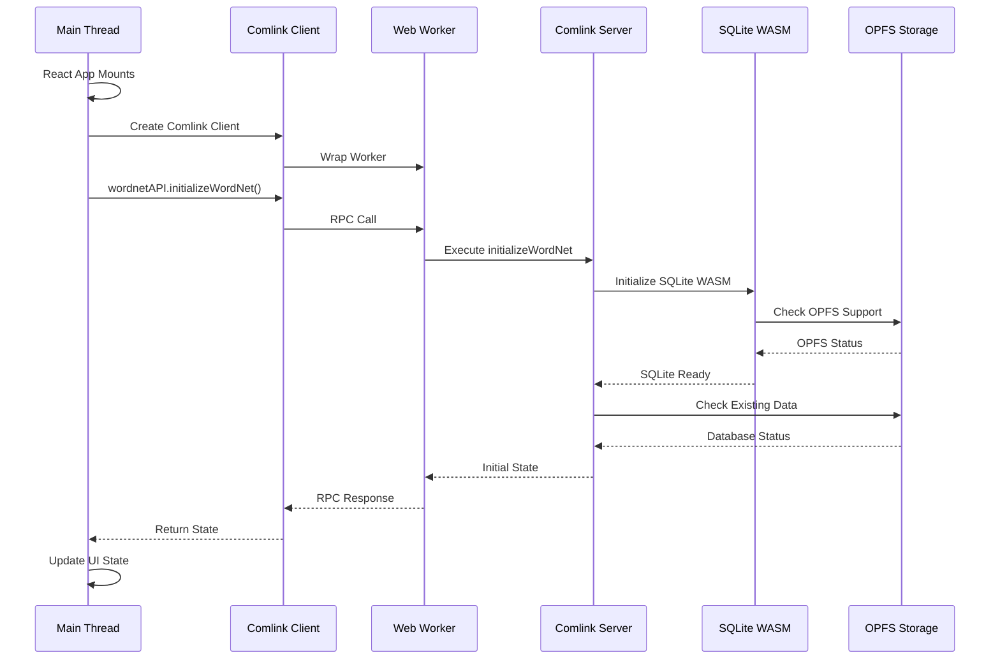
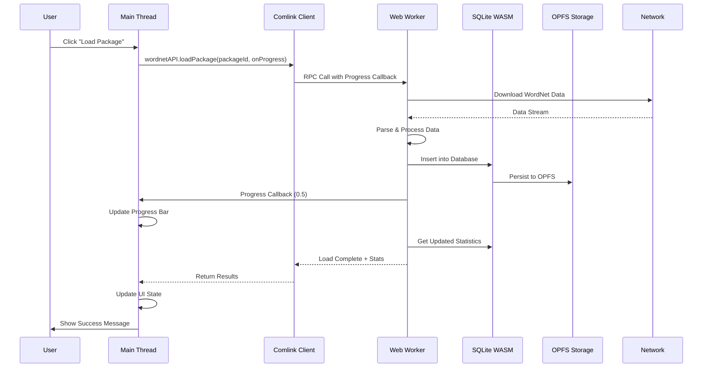
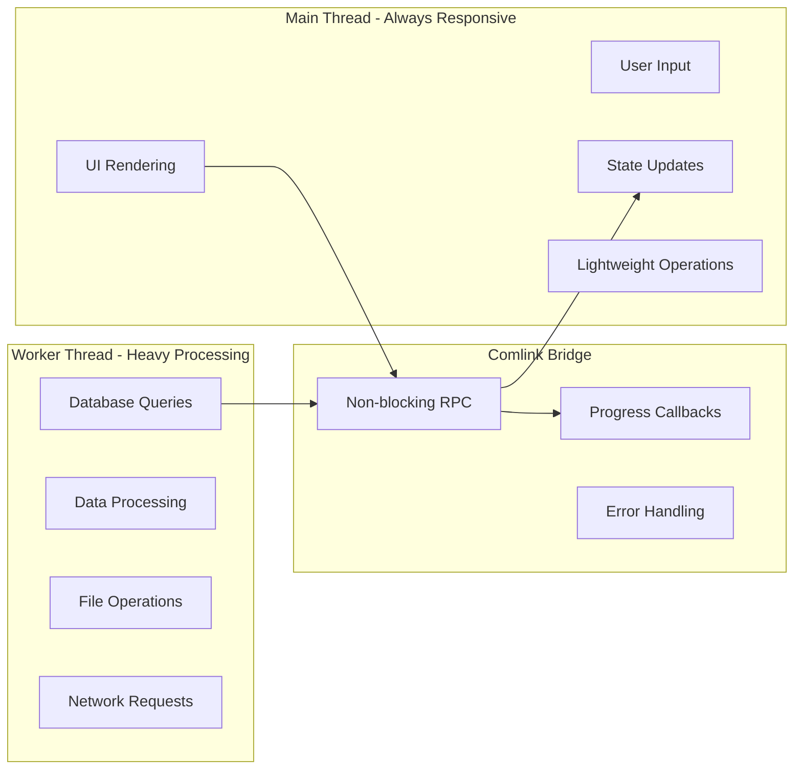
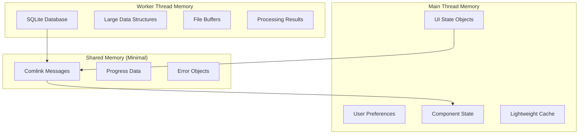
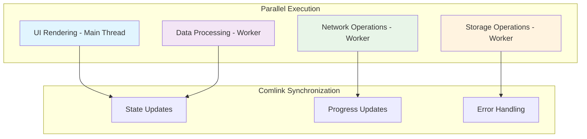

# Architecture Guide for `wn-ts-web`

This document provides a comprehensive overview of the architecture and design patterns for `wn-ts-web`, including clear thread separation, parallel event flows, and the worker-first approach using Comlink.

## 🏗️ **Architecture Overview**

`wn-ts-web` follows a **worker-first, main-thread-lightweight** pattern where heavy operations are offloaded to Web Workers while keeping the UI responsive on the main thread. **Comlink is the primary communication mechanism** between threads.



## 🧵 **Thread Responsibilities - Clear Separation**

### **Main Thread (UI Thread) - Lightweight Operations Only**

**✅ ALLOWED:**
- **React Components**: Rendering and user interactions
- **State Management**: React hooks and context
- **Event Handling**: User clicks, form submissions
- **Lightweight Cache**: Small objects, user preferences
- **Progress Updates**: UI progress indicators
- **Error Display**: User-friendly error messages
- **Comlink Client**: Making RPC calls to worker

**❌ NEVER:**
- SQLite operations
- Large data processing
- File system operations
- Network requests for WordNet data
- Heavy computations
- Database queries

### **Web Worker Thread - Heavy Operations Only**

**✅ ALLOWED:**
- **SQLite Operations**: All database queries and transactions
- **OPFS Access**: File system operations for persistence
- **Data Processing**: Heavy WordNet data operations
- **Data Loading**: Downloading and parsing WordNet files
- **Statistics Calculation**: Database statistics and analytics
- **Memory-Intensive Operations**: Large dataset operations
- **Comlink Server**: Exposing API to main thread

**❌ NEVER:**
- DOM manipulation
- UI state management
- User interaction handling
- React component logic

## 🔗 **Comlink Communication Pattern**

### **Worker Setup (Comlink Server)**

```typescript
// wordnet.worker.ts
import { expose } from 'comlink';
import { createWordNetInstance } from 'wn-ts-web';

let wordnet: any;
let dataLoader: any;

// Expose API to main thread via Comlink
export const api = {
  // Initialize WordNet instance
  async initializeWordNet() {
    try {
      const instance = await createWordNetInstance();
      wordnet = instance.wordnet;
      dataLoader = instance.dataLoader;
      
      // Return initial state for UI rehydration
      const lexiconStats = await wordnet.getLexiconStatistics();
      const statistics = await wordnet.getStatistics();
      
      return { 
        success: true, 
        data: { lexiconStats, statistics } 
      };
    } catch (error) {
      return { success: false, error: error.message };
    }
  },

  // Query operations
  async queryWords(term: string) {
    if (!wordnet) throw new Error('WordNet not initialized');
    const results = await wordnet.words(term);
    return { success: true, data: results };
  },

  async querySynsets(term: string) {
    if (!wordnet) throw new Error('WordNet not initialized');
    const results = await wordnet.synsets(term);
    return { success: true, data: results };
  },

  // Data loading operations
  async loadPackage(packageId: string, options?: { onProgress?: (p: number) => void }) {
    if (!dataLoader) throw new Error('DataLoader not initialized');
    
    await dataLoader.downloadAndLoad(packageId, {
      onProgress: options?.onProgress
    });
    
    // Return updated state
    const statistics = await wordnet.getStatistics();
    const lexiconStats = await wordnet.getLexiconStatistics();
    
    return { 
      success: true, 
      data: { statistics, lexiconStats } 
    };
  },

  // Status and utility operations
  async getStatus() {
    if (!wordnet) return { success: false, error: 'Not initialized' };
    
    const lexiconStats = await wordnet.getLexiconStatistics();
    const statistics = await wordnet.getStatistics();
    
    return { 
      success: true, 
      data: { lexiconStats, statistics } 
    };
  },

  async clearData() {
    if (!dataLoader) return { success: false, error: 'Not initialized' };
    
    await dataLoader.clearAllData();
    return { success: true };
  }
};

// Expose the API to main thread
expose(api);
```

### **Main Thread Usage (Comlink Client)**

```typescript
// main.ts or React hook
import { wrap } from 'comlink';

// Create worker and wrap with Comlink
const worker = new Worker(new URL('./wordnet.worker.ts', import.meta.url), { 
  type: 'module' 
});
const wordnetAPI = wrap<any>(worker);

// Usage in React hook
export function useWordNet() {
  const [state, setState] = useState({
    isReady: false,
    loading: false,
    error: null,
    loadedPackages: [],
    statistics: null
  });

  const initialize = useCallback(async () => {
    setState(prev => ({ ...prev, loading: true }));
    
    try {
      // Call worker via Comlink
      const result = await wordnetAPI.initializeWordNet();
      
      if (result.success) {
        const { lexiconStats, statistics } = result.data;
        setState(prev => ({
          ...prev,
          isReady: true,
          loading: false,
          loadedPackages: lexiconStats.map((ls: any) => ls.lexiconId),
          statistics
        }));
      } else {
        throw new Error(result.error);
      }
    } catch (error) {
      setState(prev => ({
        ...prev,
        loading: false,
        error: error.message
      }));
    }
  }, []);

  const queryWords = useCallback(async (term: string) => {
    try {
      const result = await wordnetAPI.queryWords(term);
      return result.success ? result.data : [];
    } catch (error) {
      console.error('Query failed:', error);
      return [];
    }
  }, []);

  const loadPackage = useCallback(async (packageId: string, onProgress?: (p: number) => void) => {
    try {
      const result = await wordnetAPI.loadPackage(packageId, { onProgress });
      
      if (result.success) {
        const { statistics, lexiconStats } = result.data;
        setState(prev => ({
          ...prev,
          statistics,
          loadedPackages: [...prev.loadedPackages, packageId]
        }));
      }
      
      return result;
    } catch (error) {
      console.error('Package loading failed:', error);
      throw error;
    }
  }, []);

  return {
    ...state,
    initialize,
    queryWords,
    loadPackage
  };
}
```

## 🔄 **Parallel Event Flows with Comlink**

### **1. Application Initialization Flow**



### **2. Data Loading Flow with Progress**



## 🚀 **Performance Optimizations**

### **Thread Isolation Benefits**



### **Memory Management Strategy**



## 🔧 **Implementation Guidelines**

### **1. Always Use Comlink for Worker Communication**

```typescript
// ❌ WRONG - Direct worker messaging
worker.postMessage({ type: 'query', term: 'joy' });
worker.onmessage = (ev) => { /* handle response */ };

// ✅ CORRECT - Comlink RPC
const wordnetAPI = wrap<any>(worker);
const results = await wordnetAPI.queryWords('joy');
```

### **2. Keep Main Thread Lightweight**

```typescript
// ❌ WRONG - Heavy operations on main thread
const results = await wordnet.words('joy'); // Direct WordNet call

// ✅ CORRECT - Delegate to worker
const results = await wordnetAPI.queryWords('joy'); // Worker call
```

### **3. Use Progress Callbacks for Long Operations**

```typescript
// ✅ CORRECT - Progress tracking
await wordnetAPI.loadPackage('oewn:2024', {
  onProgress: (progress) => {
    setProgress(progress); // Update UI on main thread
  }
});
```

### **4. Return Structured Responses**

```typescript
// ✅ CORRECT - Consistent response format
return { 
  success: true, 
  data: { results, statistics },
  metadata: { timestamp: Date.now() }
};

// ❌ WRONG - Inconsistent responses
return results; // No error handling info
```

## 🎯 **Key Benefits of This Architecture**

1. **UI Responsiveness**: Main thread never blocks on heavy operations
2. **Scalability**: Worker can handle multiple concurrent operations
3. **Persistence**: OPFS provides fast, persistent storage
4. **Fallback Support**: Graceful degradation when workers fail
5. **Memory Efficiency**: Heavy operations isolated in worker context
6. **Type Safety**: Comlink provides full TypeScript support
7. **Performance**: Parallel execution of UI updates and data processing
8. **Clear Separation**: No confusion about what runs where

## 🔄 **Event Flow Summary**



## 🏗️ **Design Principles**

### **1. Worker-First Approach**
- All heavy operations default to worker execution
- Main thread operations are lightweight and non-blocking
- Automatic fallback to main thread when workers fail

### **2. Comlink-Only Communication**
- Never use direct worker messaging
- Always use Comlink RPC for worker communication
- Consistent API design across all worker operations

### **3. Clear Thread Boundaries**
- Main thread: UI, state, lightweight operations only
- Worker thread: Database, processing, heavy operations only
- Comlink bridge: All inter-thread communication

### **4. State Rehydration**
- Worker returns existing state on initialization
- UI reflects persisted data without manual reload
- Efficient startup with minimal network requests

This architecture ensures that `wn-ts-web` operates efficiently in the browser while providing a responsive, interactive experience that never blocks the user interface. The clear separation between UI and worker threads, combined with Comlink's ergonomic RPC, makes the library both performant and easy to use.
